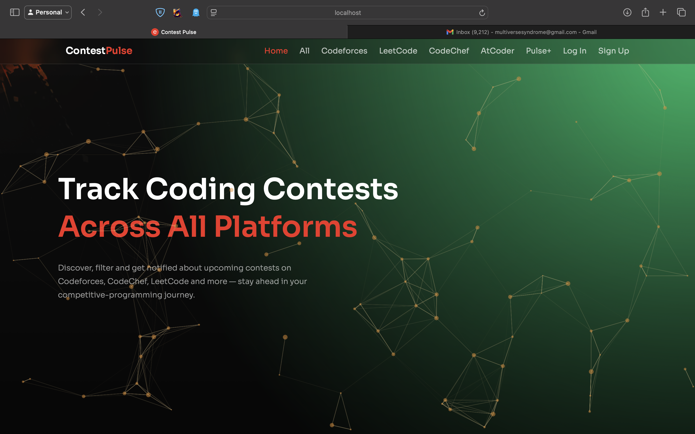
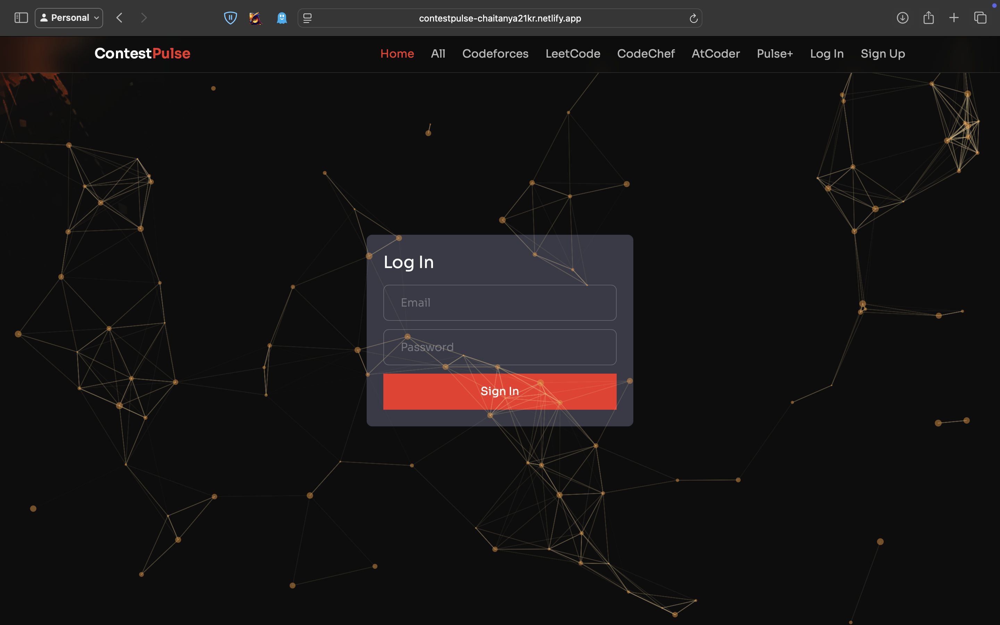
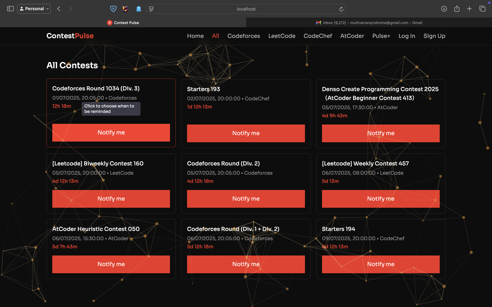
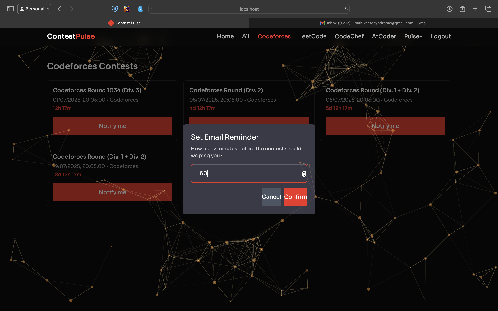
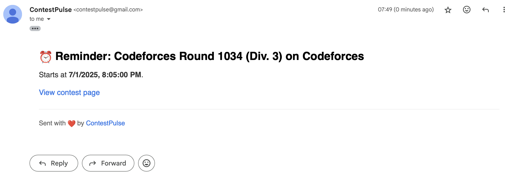
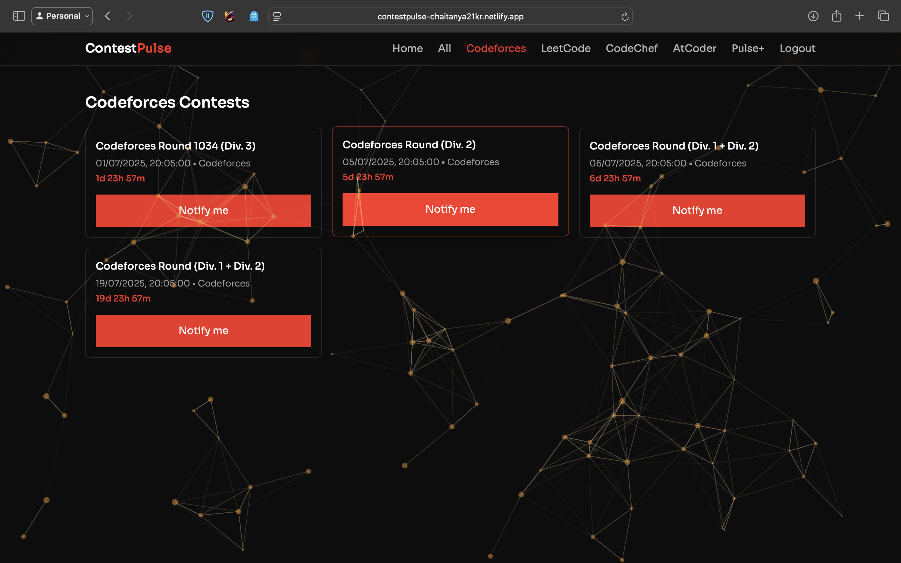
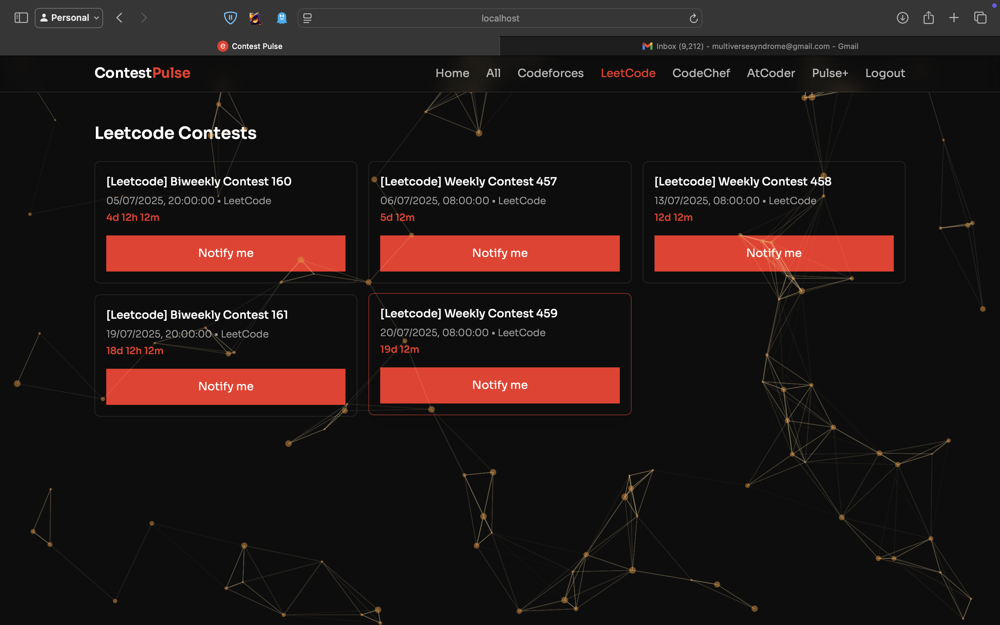
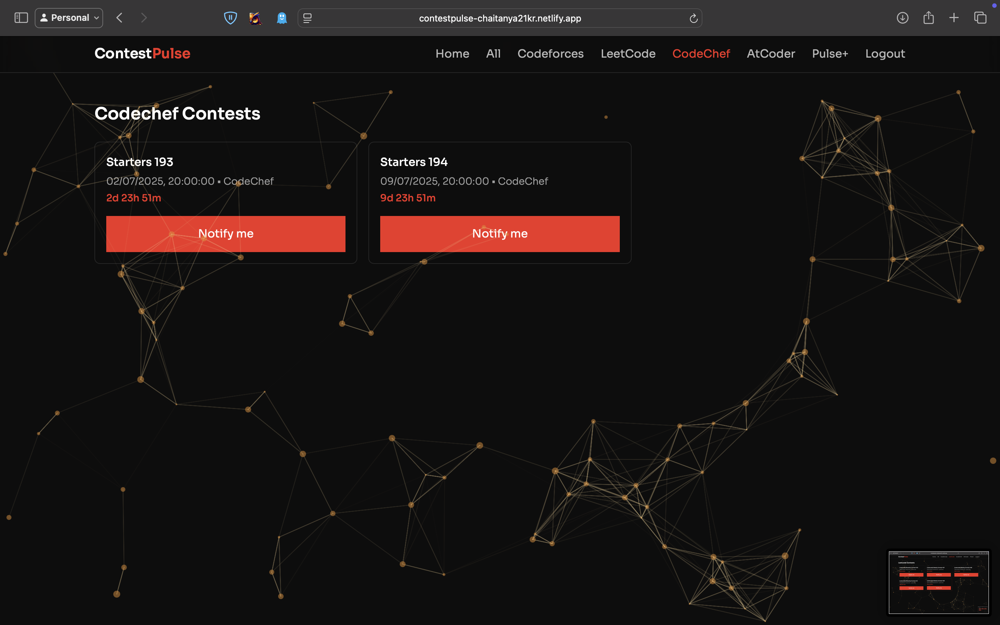
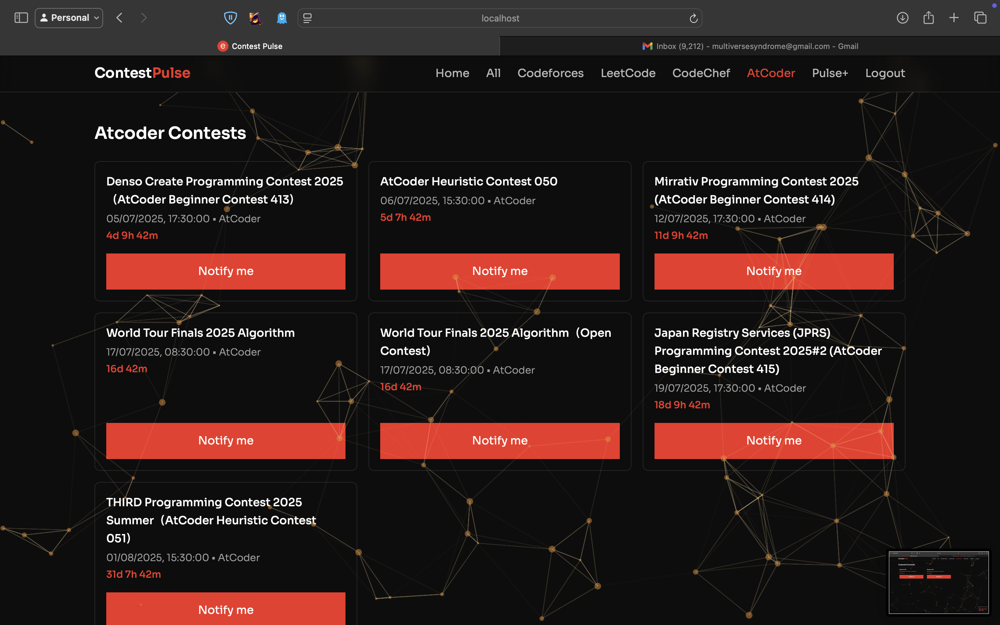
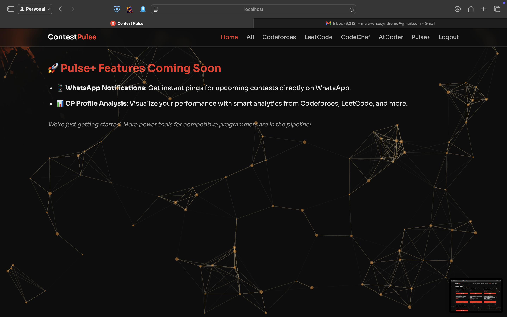

<h1 align="center">🚀 ContestPulse</h1>

Your smart coding contest tracker — across Codeforces, LeetCode, CodeChef, and AtCoder. Never miss a contest again.

<i>Track Contests from All Platforms · Get Instant Alerts & Analytics 💡</i>

  

---

## 🚀 Project Description

**ContestPulse** is a sleek, modern, and efficient web app built to help competitive programmers stay ahead of the curve. It fetches real-time contest data from major CP platforms and provides one-click notifications with a clean, dynamic interface.

---

## ✨ Features

- 🔍 **Unified Contest Feed** – View contests from Codeforces, LeetCode, CodeChef, and AtCoder in one timeline.  
- 🚨 **Instant Notifications** – One-click immediate contest alerts.  
- ⏰ **Customizable Reminders** – Schedule email reminders minutes before any contest.  
- 🧠 **Smart Filtering** – Quickly filter contests by platform.  
- 🌗 **Dark Mode UI** – Optimized for long night grinds.  
- 🔐 **Authentication** – Personalized greeting post-login.

---

## 🌐 Live Site

**👉 [Visit ContestPulse on Netlify](https://contestpulse-chaitanya21kr.netlify.app)**

---

## 🖼️ Screenshots (Logical Flow)

### 🏠 Home Page

### 🔐 Login Page

### 🗂️ All Contests

### 🔔 Notify Me Dialog  

### 📧 Email Notification Received  

### 💪 Codeforces

### 🧠 LeetCode

### 🍛 CodeChef

### 🥷 AtCoder

### 💡 Pulse+ (Coming Soon)

---

## 🛠️ Tech Stack

- **Frontend**: Next.js, React, TailwindCSS  
- **Backend**: Node.js, Express.js  
- **Database**: MongoDB  
- **Auth**: Google OAuth via NextAuth  
- **Analytics**: Google Analytics 4  
- **Deployment**: Netlify

---

## 🔮 Future Plans (Pulse+)

| Feature                    | Description                                                               |
|----------------------------|---------------------------------------------------------------------------|
| 📱 WhatsApp Notifications   | Get instant contest reminders on WhatsApp                                 |
| 📊 CP Profile Analysis      | Analyze and visualize your performance from Codeforces, LeetCode, etc.    |

---

## 📜 License

This project is licensed under the **MIT License**.

---

## ☕ Sponsor

If you love this project and want to support its growth:

  

Any small contribution helps 💛 

---
